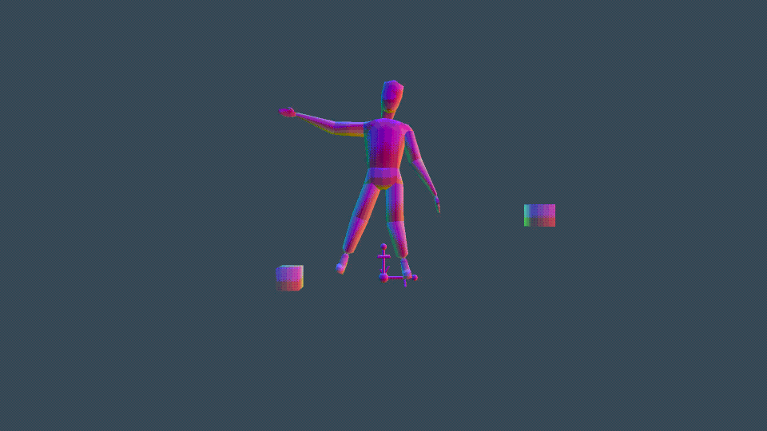

This is a 3D engine with things like skeletal animation, mesh rendering, instancing and more. This version is EXTREMELY outdated and the newer version is structured completely different as it is utilizing an ECS. The code for that version of the engine will be made public sometime soon.

You will need to replace [CGLMs](https://github.com/recp/cglm) path in the make file to compile.

The client can be compiled for Windows, Linux, and HTML5

